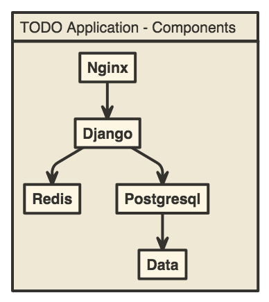

# TODO Application

This is a Web application of TODO made in [Django](https://www.djangoproject.com/) and configured with [docker-compose](https://docs.docker.com/compose/)

## Guides

- [Real Python Page](https://realpython.com/blog/python/django-development-with-docker-compose-and-machine/)

## Components

---

Created with :heart: by [yoelfme](https://twitter.com/yoelfme)
